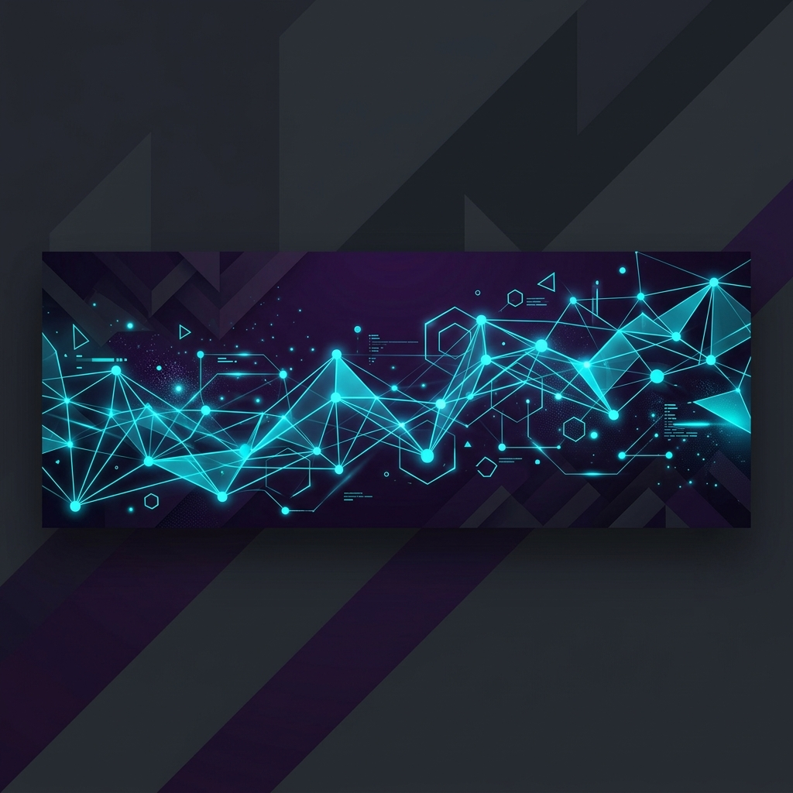

  

<h1 align="center">Hi there, I'm Jalwa Jabbar! 👋</h1>

  <strong>B.Tech Computer Science & Engineering Student | Full-Stack Web Developer | Software Engineer</strong>

  
  
  

## 🚀 About Me

I am a **B.Tech Computer Science & Engineering student** at Saintgits College of Engineering, with hands-on experience in building scalable web applications. Passionate about problem-solving, full-stack development, API integration, and data analytics. I enjoy translating complex requirements into elegant, high-performance code.

- 🎓 Currently pursuing B.Tech in CSE at Saintgits College of Engineering
- 💼 Former Software Developer Intern at Hult Infotech
- 🌱 Always learning new technologies and exploring web architecture
- ✉️ Feel free to reach out: [jalwajabbar@gmail.com](mailto:jalwajabbar@gmail.com)

## 🛠️ Technical Skills

<table align="center" width="100%">
  <tr>
    <td valign="top" width="50%">
      <h4>💻 Languages & Core</h4>
      
      
      
      
      
    </td>
    <td valign="top" width="50%">
      <h4>🌐 Web & Frontend</h4>
      
      
      
    </td>
  </tr>
  <tr>
    <td valign="top" width="50%">
      <h4>⚙️ Backend & Databases</h4>
      
      
      
      
    </td>
    <td valign="top" width="50%">
      <h4>🔧 Tools & Methods</h4>
      
      
      
    </td>
  </tr>
</table>

## 💼 Professional Experience

### 🏢 Hult Infotech — *Software Developer Intern*
*December 2024 – July 2025*

* **⚛️ Scalable Frontend Components:** Developed and optimized reusable React.js components for an e-commerce platform, leading to improved UI consistency and a premium user experience.
* **🌐 RESTful API Integration:** Designed, built, and integrated RESTful APIs using Node.js and Express.js for key operations like product management, order processing, and user workflows.
* **⚡ Interactive UI Features:** Implemented advanced features including dynamic search suggestions, wishlist modules, user-specific filtering, and interactive state management.
* **🔍 Performance & Debugging:** Investigated and resolved production issues, successfully reducing load times and increasing page responsiveness across devices.
* **🤝 Agile Team Collaboration:** Actively participated in Git/GitHub branching strategies, code reviews, pull request flows, and agile standups to ensure robust version control and smooth deliveries.

## 🚀 Key Projects

### 🎙️ EchoCare – Voice-Based Healthcare System
> **Tech Stack:** Python, Speech Recognition, NLP, Modular Architecture
- Designed and built a modular voice-enabled monitoring system tailored to assist elderly users.
- Integrated advanced speech-to-text algorithms to allow hands-free verbal symptom reporting.
- Implemented sentiment analysis and symptom severity classification to automate alert generation and secure report management.

### 🪙 Clap Coin – Blockchain-Based Reward System
> **Tech Stack:** Solidity, Blockchain, Smart Contracts, Web3
- Developed a secure, decentralized reward system during the **ETHGlobal Hackathon**.
- Crafted self-executing smart contracts for secure and transparent tokenized transactions.
- Engineered safe wallet-based distribution mechanisms ensuring high reliability and auditability.

## 🎓 Education & Credentials

### 🏫 Saintgits College of Engineering, Kottayam
* **Degree:** B.Tech in Computer Science and Engineering
* **Duration:** 2023 – Present

### 🏫 GHSS Pilicode Higher Secondary School
* **Stream:** Science Stream (Computer Science)
* **Performance:** **97%**
* **Duration:** 2021 – 2023

### 📜 Certifications
* 🐍 **Fundamentals of Python Programming**
* 🛡️ **Cyber Security and Ethical Hacking**
* ☕ **Programming using Java** *(Infosys Springboard)*

## 📊 GitHub Analytics

  
  

  

